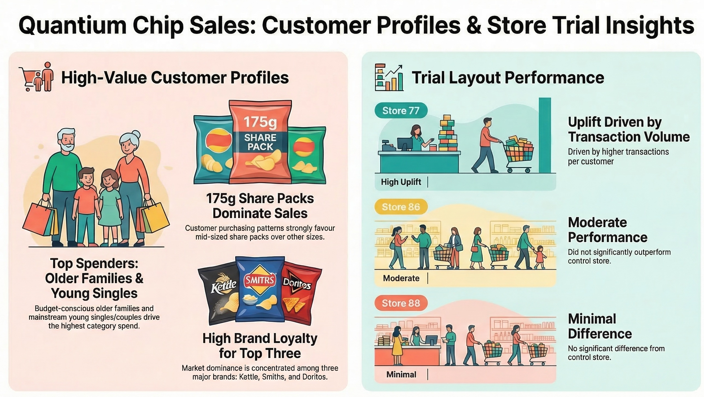
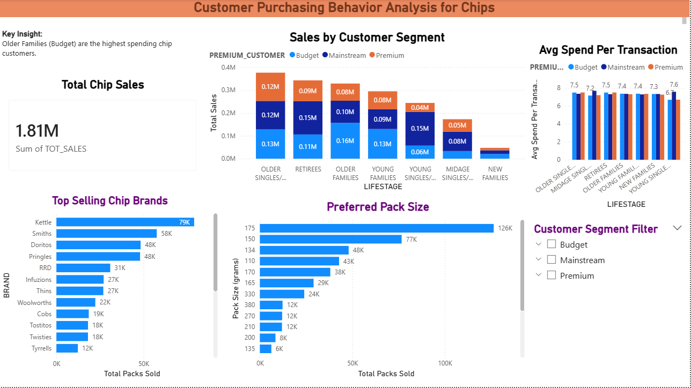

# Quantium Chip Sales Analysis

## Project Overview




This project analyzes customer purchasing behaviour for the **chips category** using retail transaction and customer data.

The objective is to identify the **customer segments that drive chip sales**, evaluate the **impact of store layout trials**, and provide **data-driven insights to support category strategy**.

This project was completed as part of the **Quantium Retail Analytics Virtual Experience (Forage)**.

---

## Tools Used

- **SQL** – data cleaning, feature engineering, and analysis  
- **Power BI** – dashboard creation and visualization  
- **Excel / CSV** – source datasets  

---

## Project Workflow

### Task 1 – Data Cleaning & Customer Segmentation
1. Performed data quality checks to identify missing values, inconsistencies, and outliers.  
2. Cleaned and prepared transaction and customer datasets.  
3. Derived additional features such as **pack size** and **brand names** from product descriptions.  
4. Analyzed purchasing patterns across **customer life-stage and premium segments**.

### Task 2 – Trial vs Control Store Analysis
1. Selected appropriate **control stores** based on similarity in sales performance metrics.  
2. Compared **trial stores vs control stores** using metrics such as:
   - total sales revenue  
   - number of customers  
   - transactions per customer  
3. Evaluated whether the new **store layout trial impacted chip sales**.

### Task 3 – Strategic Business Report
1. Created a **client-ready report** summarizing insights and recommendations.  
2. Applied the **Pyramid Principle framework** to communicate findings clearly.  
3. Delivered strategic recommendations to support the **category manager’s decision-making**.

---

## Key Insights

- **Older Families (Budget)** generate the highest chip sales.
- **Young Singles/Couples (Mainstream)** are another major contributor.
- The most popular pack size is **175g**, indicating strong demand for share-size packs.
- Leading chip brands include **Kettle, Smiths, and Doritos**.
- Store layout trials showed measurable differences in purchasing behaviour across stores.
- Average spending per transaction is approximately **$7 – $7.6**.

---

## Dashboard

### Sales Analysis Dashboard




Additional visualizations include:

- Pack Size Analysis  
- Sales by Customer Segment  
- Store Trial Performance  

---

## Repository Structure

```
data/
      purchase_behavior.csv
      transaction_data.csv


sql/
   chip_sales_analysis.sql
   store_trial_control_analysis.sql

dashboard/
   chip_sales_dashboard.pbix
   store_trial_dashboard.pbix

images/
   dashboard_overview.png
   pack_size.png
   sales_by_segment.png
   store_trial_analysis_dashboard.png
   project_summary_infographic.jpg

report/
   chip_sales_strategy_report.pdf
```

---

## Business Recommendations

- Marketing strategies should focus on **Older Families (Budget)** and **Young Singles/Couples**, as these segments drive the majority of chip sales.
- Promotions around **popular brands and pack sizes** could further increase category revenue.
- Successful **store layout strategies** from trial stores could be expanded to other locations.

---


